# Sentinel AI - Detailed Process Flow Documentation

This document provides comprehensive process flow diagrams and explanations for all processing scenarios in Sentinel AI.

## Table of Contents

- [Document Processing Flows](#document-processing-flows)
- [Audio Processing Flows](#audio-processing-flows)
- [Video Processing Flows](#video-processing-flows)
- [Graph Processing Flow](#graph-processing-flow)
- [Model Selection Decision Trees](#model-selection-decision-trees)
- [Error Handling Flows](#error-handling-flows)

## Document Processing Flows

### English PDF Processing

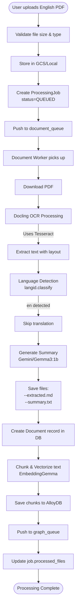

### Hindi PDF Processing

```mermaid
flowchart TD
    Start([User uploads Hindi PDF]) --> Validate[Validate file size & type]
    Validate --> Store[Store in GCS/Local]
    Store --> CreateJob[Create ProcessingJob<br/>status=QUEUED]
    CreateJob --> PushQueue[Push to document_queue]
    
    PushQueue --> Worker[Document Worker picks up]
    Worker --> Download[Download PDF]
    Download --> Docling[Docling OCR Processing]
    Docling --> |Tesseract with hin| ExtractText[Extract Hindi text]
    ExtractText --> DetectLang[Language Detection<br/>langid.classify]
    DetectLang --> |hi detected| TranslateJSON[JSON-based Translation]
    TranslateJSON --> |M2M100 hi→en| TranslatedText[English text]
    TranslatedText --> Summary[Generate Summary<br/>Gemini/Gemma3:1b<br/>on English text]
    Summary --> SaveFiles[Save files:<br/>---extracted.md Hindi<br/>---translated.md English<br/>---summary.txt English]
    SaveFiles --> CreateDoc[Create Document record]
    CreateDoc --> Vectorize[Vectorize English text<br/>EmbeddingGemma]
    Vectorize --> SaveChunks[Save chunks to AlloyDB]
    SaveChunks --> QueueGraph[Push translated text<br/>to graph_queue]
    QueueGraph --> UpdateJob[Update job.processed_files]
    UpdateJob --> End([Processing Complete])
```

### TXT File Processing

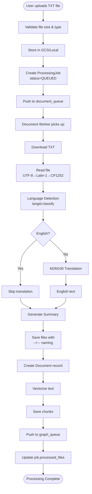

### DOCX File Processing

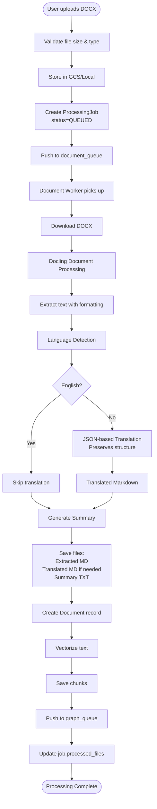

## Audio Processing Flows

### English Audio Processing (Dev Mode)

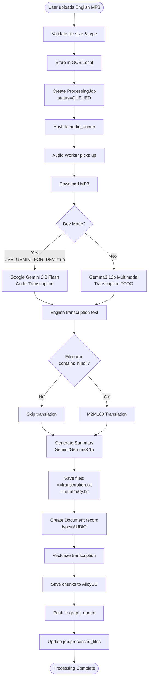

### Hindi Audio Processing (Dev Mode)

```mermaid
flowchart TD
    Start([User uploads hindi_audio.mp3]) --> Validate[Validate file size & type]
    Validate --> Store[Store in GCS/Local]
    Store --> CreateJob[Create ProcessingJob<br/>status=QUEUED]
    CreateJob --> PushQueue[Push to audio_queue]
    
    PushQueue --> Worker[Audio Worker picks up]
    Worker --> Download[Download MP3]
    Download --> GeminiTranscribe[Google Gemini 2.0 Flash<br/>Audio Transcription<br/>with Hindi prompt]
    
    GeminiTranscribe --> HindiTranscription[Hindi transcription text]
    HindiTranscription --> CheckFilename{Filename<br/>contains 'hindi'?}
    CheckFilename --> |Yes| Translate[M2M100 Translation<br/>Hindi → English]
    
    Translate --> EnglishText[English text]
    EnglishText --> Summary[Generate English Summary<br/>Gemini/Gemma3:1b]
    
    Summary --> SaveFiles[Save files:<br/>===transcription.txt Hindi<br/>===translated.txt English<br/>===summary.txt English]
    SaveFiles --> CreateDoc[Create Document record<br/>type=AUDIO]
    CreateDoc --> Vectorize[Vectorize English text<br/>for searchability]
    Vectorize --> SaveChunks[Save chunks to AlloyDB]
    SaveChunks --> QueueGraph[Push translated text<br/>to graph_queue]
    QueueGraph --> UpdateJob[Update job.processed_files]
    UpdateJob --> End([Processing Complete])
```

### Audio Processing (Production Mode)

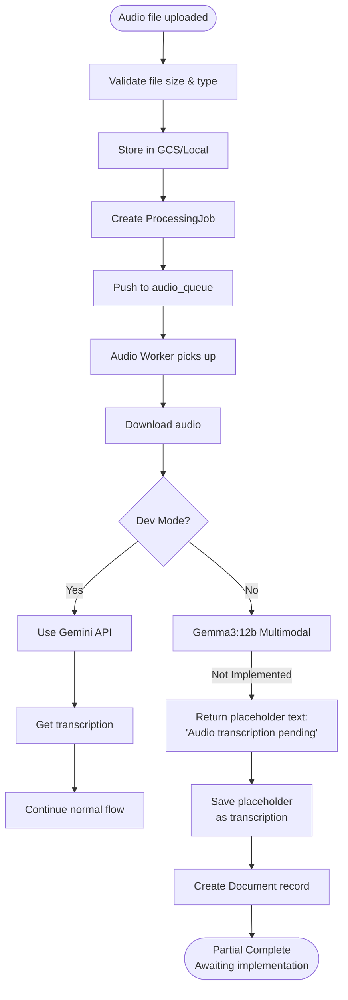

## Video Processing Flows

### English Video Processing

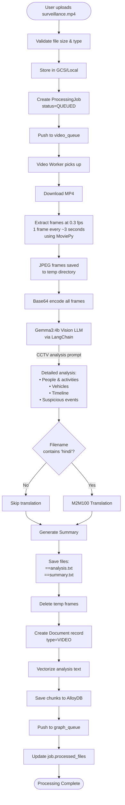

### Hindi Video Processing

```mermaid
flowchart TD
    Start([User uploads hindi_cctv.mp4]) --> Validate[Validate file size & type]
    Validate --> Store[Store in GCS/Local]
    Store --> CreateJob[Create ProcessingJob<br/>status=QUEUED]
    CreateJob --> PushQueue[Push to video_queue]
    
    PushQueue --> Worker[Video Worker picks up]
    Worker --> Download[Download MP4]
    Download --> ExtractFrames[Extract frames at 0.3 fps<br/>MoviePy]
    
    ExtractFrames --> Frames[JPEG frames]
    Frames --> EncodeFrames[Base64 encode frames]
    EncodeFrames --> VisionLLM[Gemma3:4b Vision LLM<br/>CCTV analysis prompt]
    
    VisionLLM --> Analysis[Analysis in English<br/>Vision models output English]
    
    Analysis --> CheckFilename{Filename<br/>contains 'hindi'?}
    CheckFilename --> |Yes| Translate[Apply M2M100 Translation<br/>if needed for audio overlay]
    
    Translate --> TranslatedAnalysis[Translated analysis]
    TranslatedAnalysis --> Summary[Generate English Summary]
    
    Summary --> SaveFiles[Save files:<br/>===analysis.txt<br/>===translated.txt if applicable<br/>===summary.txt]
    SaveFiles --> CleanupFrames[Delete temp frames]
    CleanupFrames --> CreateDoc[Create Document record<br/>type=VIDEO]
    CreateDoc --> Vectorize[Vectorize analysis]
    Vectorize --> SaveChunks[Save chunks]
    SaveChunks --> QueueGraph[Push to graph_queue]
    QueueGraph --> UpdateJob[Update job.processed_files]
    UpdateJob --> End([Processing Complete])
```

## Graph Processing Flow

### Knowledge Graph Extraction

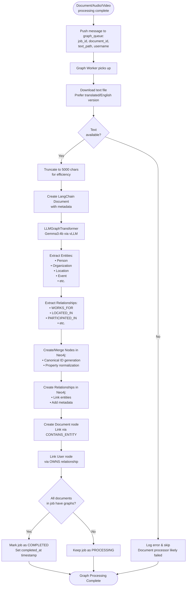

### Graph Node Structure

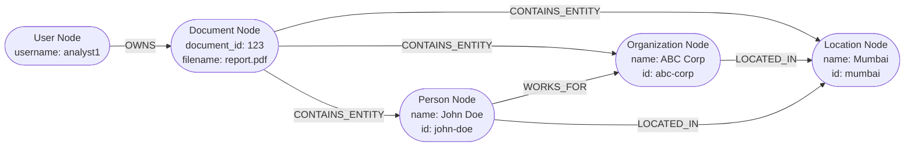

## Model Selection Decision Trees

### Summarization Model Selection

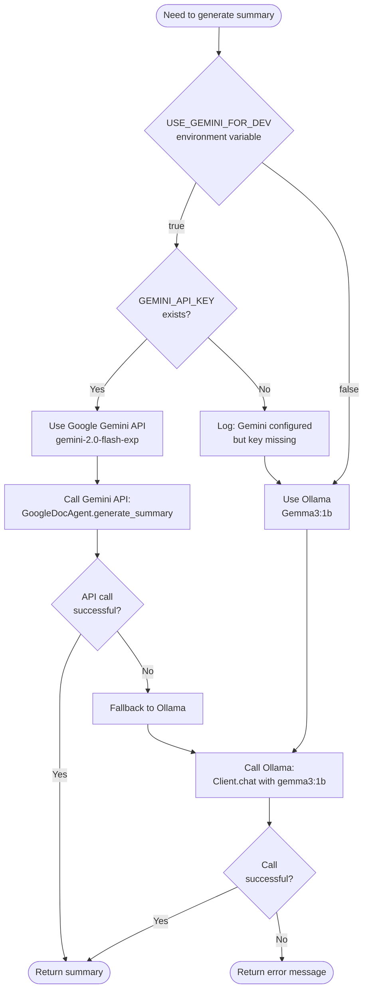

### Transcription Model Selection

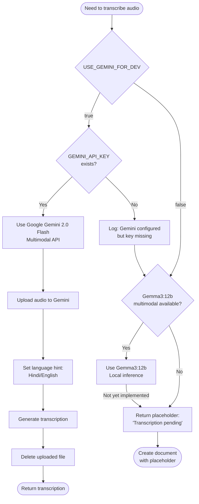

### Chat Model Selection

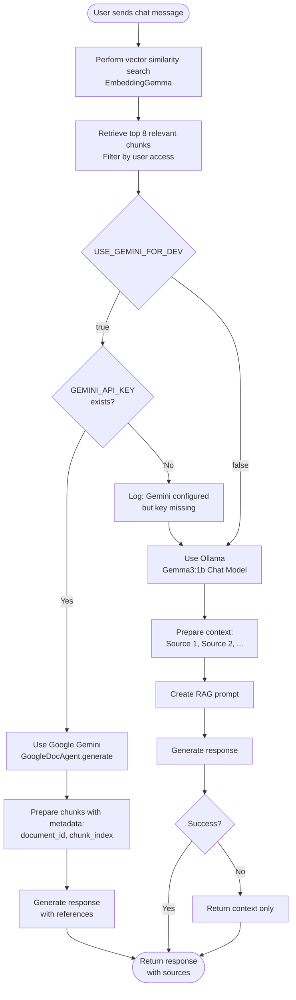

## Error Handling Flows

### Document Processing Error Handling

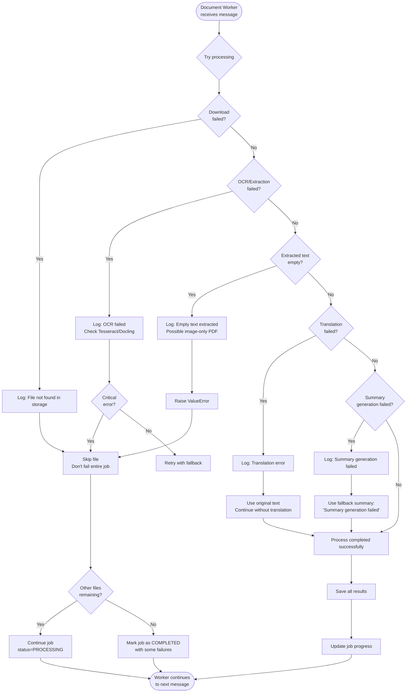

### Graph Processing Error Handling

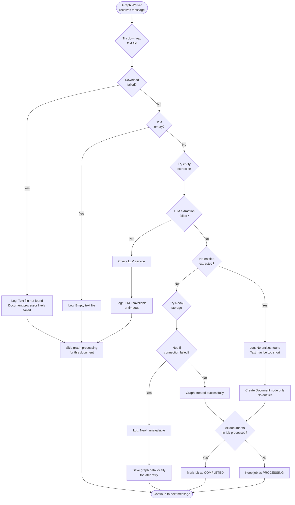

### Redis Queue Error Handling

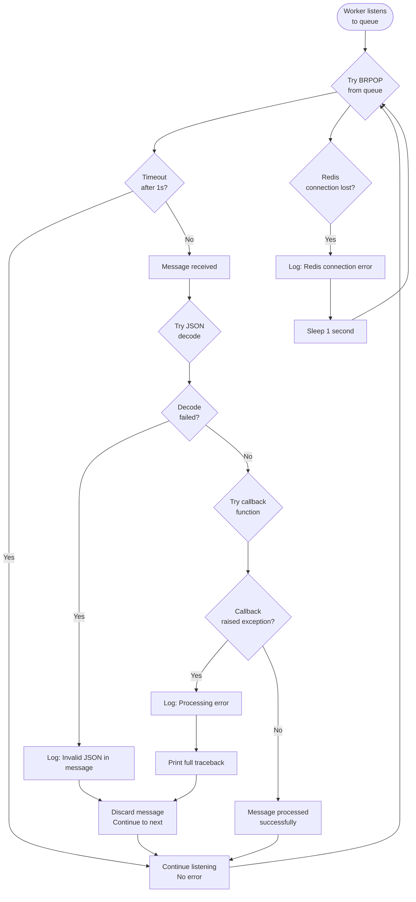

## Performance Optimization Flows

### Parallel Processing with Multiple Workers

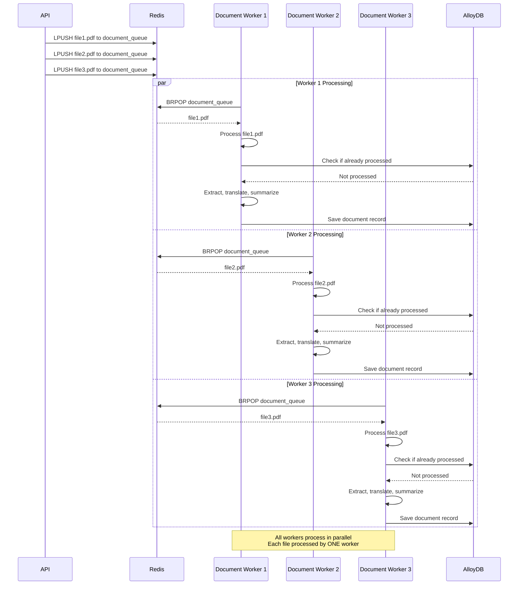

### Distributed Locking Mechanism

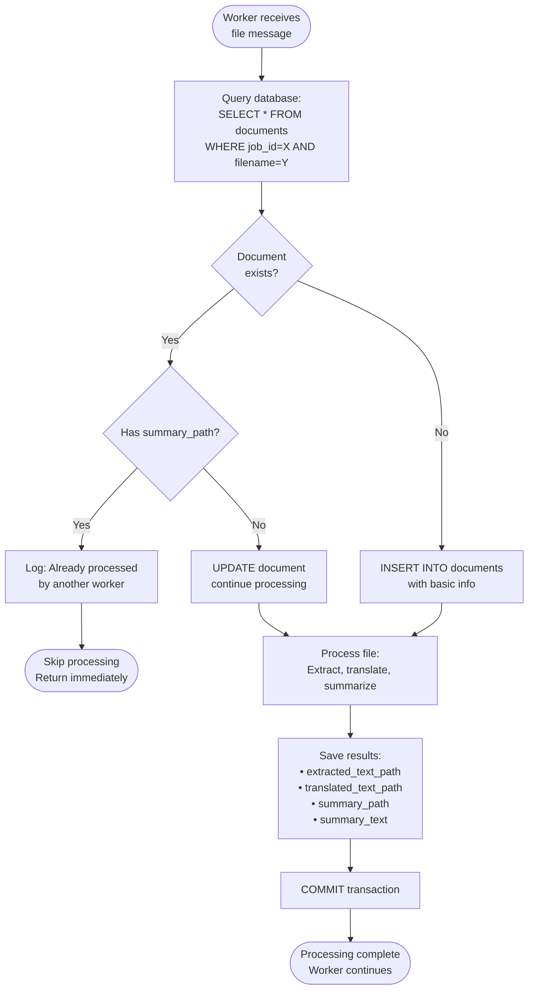

## Summary of Key Differences

### File Naming Conventions Summary

| Scenario | Extracted | Translated | Summary | Example |
|----------|-----------|------------|---------|---------|
| **Document (English)** | `--extracted.md` | - | `--summary.txt` | `report--extracted.md` |
| **Document (Hindi)** | `---extracted.md` | `---translated.md` | `---summary.txt` | `hindi---extracted.md` |
| **Audio (English)** | `==transcription.txt` | - | `==summary.txt` | `audio.mp3==transcription.txt` |
| **Audio (Hindi)** | `===transcription.txt` | `===translated.txt` | `===summary.txt` | `hindi.mp3===transcription.txt` |
| **Video (English)** | `==analysis.txt` | - | `==summary.txt` | `cctv.mp4==analysis.txt` |
| **Video (Hindi)** | `===analysis.txt` | `===translated.txt` | `===summary.txt` | `hindi.mp4===analysis.txt` |

### Model Usage Summary

| Task | Dev Mode | Production Mode |
|------|----------|-----------------|
| **Document Summary** | Google Gemini 2.0 Flash | Ollama Gemma3:1b |
| **Audio Transcription** | Google Gemini 2.0 Flash | Gemma3:12b multimodal (pending) |
| **Video Analysis** | Gemma3:4b Vision (LangChain) | Gemma3:4b Vision (LangChain) |
| **Chat/Q&A** | Google Gemini 2.0 Flash | Ollama Gemma3:1b |
| **Knowledge Graph** | Gemma3:4b (vLLM) | Gemma3:4b (vLLM) |
| **Translation** | M2M100 (dl-translate) | M2M100 (dl-translate) |
| **Embeddings** | EmbeddingGemma (Ollama) | EmbeddingGemma (Ollama) |

---

**Last Updated**: 2025-11-06  
**Version**: 1.0.0
