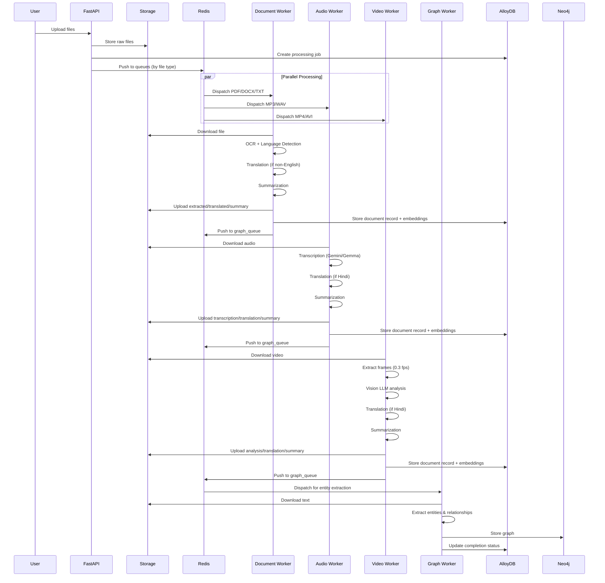

# Sentinel AI - Document Intelligence Platform


A production-ready document intelligence platform with RBAC, multi-language support, and knowledge graph extraction. Processes documents, audio, and video files through distributed workers with edge inference capabilities.

## 📋 Table of Contents

- [Overview](#overview)
- [Architecture](#architecture)
- [Processing Flow](#processing-flow)
  - [Document Processing](#document-processing)
  - [Audio Processing](#audio-processing)
  - [Video Processing](#video-processing)
  - [Graph Processing](#graph-processing)
- [Language Support](#language-support)
- [Model Configuration](#model-configuration)
- [Redis Queue System](#redis-queue-system)
- [File Naming Conventions](#file-naming-conventions)
- [Deployment](#deployment)
- [Troubleshooting](#troubleshooting)

## 🎯 Overview

Sentinel AI is an intelligent document analysis system designed for law enforcement and security applications. It processes multiple file types (PDF, DOCX, TXT, MP3, WAV, MP4, etc.) with:

- **Multi-language support**: English, Hindi, Bengali, Punjabi, Gujarati, Kannada, Malayalam, Marathi, Tamil, Telugu, Chinese
- **Automatic translation**: Non-English content is automatically translated to English
- **Knowledge graph extraction**: Entities and relationships extracted to Neo4j
- **Vector search**: Semantic search using pgvector embeddings
- **RBAC**: Role-based access control (Admin, Manager, Analyst)
- **Distributed processing**: Parallel workers via Redis queues

## 🏗️ Architecture

### System Components

```
┌─────────────────────────────────────────────────────────────────┐
│                         Frontend (Next.js)                       │
└────────────────────────────┬────────────────────────────────────┘
                             │
                             ▼
┌─────────────────────────────────────────────────────────────────┐
│                    FastAPI Backend (main.py)                     │
│  • File Upload & Validation                                      │
│  • Job Management                                                │
│  • User Authentication (JWT)                                     │
│  • RBAC Enforcement                                              │
└────────┬─────────────────────────────────────────┬──────────────┘
         │                                          │
         ▼                                          ▼
┌─────────────────────┐                    ┌─────────────────────┐
│  Storage (GCS/Local) │                    │   AlloyDB/SQLite    │
│  • Raw files         │                    │   • Jobs            │
│  • Extracted text    │                    │   • Documents       │
│  • Translations      │                    │   • Users           │
│  • Summaries         │                    │   • Chunks+Vectors  │
└─────────────────────┘                    └─────────────────────┘
         │
         ▼
┌─────────────────────────────────────────────────────────────────┐
│                      Redis Queue System                          │
│  • document_queue: PDF, DOCX, TXT processing                    │
│  • audio_queue: MP3, WAV, M4A processing                        │
│  • video_queue: MP4, AVI, MOV processing                        │
│  • graph_queue: Knowledge graph extraction                      │
└────┬──────────────┬──────────────┬──────────────┬──────────────┘
     │              │              │              │
     ▼              ▼              ▼              ▼
┌──────────┐  ┌──────────┐  ┌──────────┐  ┌──────────────┐
│ Document │  │  Audio   │  │  Video   │  │    Graph     │
│ Processor│  │ Processor│  │ Processor│  │  Processor   │
│          │  │          │  │          │  │              │
│ • OCR    │  │ • Trans- │  │ • Frame  │  │ • Entity     │
│ • Lang   │  │   cribe  │  │   Extract│  │   Extraction │
│   Detect │  │ • Trans- │  │ • Vision │  │ • Neo4j      │
│ • Trans- │  │   late   │  │   LLM    │  │   Storage    │
│   late   │  │ • Summary│  │ • Summary│  │              │
│ • Summary│  │          │  │          │  │              │
└────┬─────┘  └────┬─────┘  └────┬─────┘  └──────────────┘
     │             │             │
     └─────────────┴─────────────┘
                   │
                   ▼
         ┌─────────────────────┐
         │   Neo4j Graph DB    │
         │   • Entities        │
         │   • Relationships   │
         └─────────────────────┘
```

### Technology Stack

- **Backend**: FastAPI, SQLAlchemy, Pydantic
- **Database**: AlloyDB (PostgreSQL) with pgvector, SQLite (dev)
- **Graph DB**: Neo4j
- **Cache/Queue**: Redis
- **Storage**: Google Cloud Storage / Local Filesystem
- **OCR**: Tesseract, Docling
- **Translation**: dl-translate (M2M100)
- **LLMs**: 
  - **Dev Mode**: Google Gemini (gemini-2.0-flash-exp)
  - **Production**: Ollama (Gemma3:1b, Gemma3:4b, Gemma3:12b)
- **Embeddings**: EmbeddingGemma via Ollama
- **Frontend**: Next.js, React, TypeScript

## 🔄 Processing Flow

### High-Level Flow



### Document Processing

**Supported Formats**: `.pdf`, `.docx`, `.txt`

#### Process Flow

1. **File Upload** → `POST /api/v1/upload`
   - Files validated for size (max 4MB default) and type
   - Stored in configured storage backend
   - Job record created with `status=QUEUED`
   - File pushed to `document_queue`

2. **Document Worker** (document_processor_service.py)
   
   **Step 1: Text Extraction**
   ```
   PDF/DOCX → Docling (OCR + Layout Analysis)
              ├── Uses Tesseract for OCR
              ├── Supports multi-language (eng, hin, ben, pan, etc.)
              └── Outputs structured JSON + Markdown
   
   TXT → Direct file read (UTF-8 → Latin-1 → CP1252 fallback)
   ```

   **Step 2: Language Detection**
   ```
   Text → langid.classify()
          ├── If 'en' → Skip translation
          └── If non-English → Mark for translation
   ```

   **Step 3: Translation** (if needed)
   ```
   For PDF/DOCX with Docling JSON:
     JSON structure → translate_json_object()
                      ├── Chunk by structure
                      ├── Translate with M2M100
                      └── Reconstruct Markdown
   
   For TXT files:
     Text → M2M100 translation
            (hindi → english, etc.)
   ```

   **Step 4: Summarization**
   ```
   Text → LLM Summary
          ├── Dev: Google Gemini API (gemini-2.0-flash-exp)
          └── Prod: Ollama Gemma3:1b
   ```

   **Step 5: Storage**
   ```
   Original: uploads/manager/analyst/uuid/file.pdf
   Extracted: uploads/manager/analyst/uuid/file--extracted.md    (English)
              uploads/manager/analyst/uuid/file---extracted.md   (Non-English)
   Translated: uploads/manager/analyst/uuid/file---translated.md
   Summary: uploads/manager/analyst/uuid/file--summary.txt       (English)
            uploads/manager/analyst/uuid/file---summary.txt      (Non-English)
   ```

   **Step 6: Vectorization**
   - Text chunked with RecursiveCharacterTextSplitter (2000 chars, 100 overlap)
   - Embedded using EmbeddingGemma via Ollama
   - Stored in AlloyDB with pgvector

   **Step 7: Graph Queue**
   - Document record created in DB
   - Message pushed to `graph_queue` for entity extraction

#### Language-Specific Scenarios

**Scenario 1: English PDF**
```
english.pdf → Docling OCR → English text detected
            → No translation needed
            → Summary generated
            → Saved as english--extracted.md, english--summary.txt
            → Queued for graph processing
```

**Scenario 2: Hindi PDF**
```
hindi.pdf → Docling OCR (Tesseract with hin lang data)
          → Hindi text detected (langid: 'hi')
          → JSON-based translation (M2M100: hi → en)
          → English summary generated
          → Saved as:
             • hindi---extracted.md (original Hindi)
             • hindi---translated.md (English translation)
             • hindi---summary.txt (English summary)
          → English translation queued for graph processing
```

**Scenario 3: Mixed Language Document**
```
mixed.pdf → Docling OCR (detects dominant language)
          → Primary language used for translation
          → Translation handles mixed content
          → Summary in English
```

### Audio Processing

**Supported Formats**: `.mp3`, `.wav`, `.m4a`

#### Process Flow

1. **File Upload** → Pushed to `audio_queue`

2. **Audio Worker** (audio_processor_service.py)

   **Step 1: Transcription**
   ```
   Dev Mode:
     Audio file → Google Gemini 2.0 Flash (multimodal)
                  ├── Supports multiple languages
                  ├── Accurate transcription with punctuation
                  └── Direct API call
   
   Production Mode:
     Audio file → Gemma3:12b multimodal (planned)
                  └── Local edge inference
   ```

   **Step 2: Language Detection**
   - Filename heuristic: 'hindi' in filename → Hindi
   - Otherwise: English assumed

   **Step 3: Translation** (if Hindi)
   ```
   Hindi transcription → M2M100 translation
                        └── Hindi text → English text
   ```

   **Step 4: Summarization**
   ```
   Transcribed text → LLM Summary (200 words max)
                      ├── Dev: Gemini API
                      └── Prod: Ollama Gemma3:1b
   ```

   **Step 5: Storage**
   ```
   Original: audio.mp3
   Transcription: audio.mp3==transcription.txt           (English)
                  audio.mp3===transcription.txt          (Hindi)
   Translation: audio.mp3===translated.txt               (Hindi → English)
   Summary: audio.mp3==summary.txt                       (English)
            audio.mp3===summary.txt                      (Hindi with translation)
   ```

   **Step 6: Vectorization & Graph Queue**
   - Transcription embedded and stored
   - Message pushed to `graph_queue`

#### Language-Specific Scenarios

**Scenario 1: English Audio**
```
interview.mp3 → Gemini transcription
              → English detected
              → No translation
              → Summary generated
              → Saved as interview.mp3==transcription.txt, ==summary.txt
```

**Scenario 2: Hindi Audio**
```
hindi_audio.mp3 → Gemini transcription (Hindi)
                → 'hindi' in filename detected
                → M2M100 translation (hi → en)
                → English summary generated
                → Saved as:
                   • hindi_audio.mp3===transcription.txt (Hindi)
                   • hindi_audio.mp3===translated.txt (English)
                   • hindi_audio.mp3===summary.txt (English summary)
```

### Video Processing

**Supported Formats**: `.mp4`, `.avi`, `.mov`

#### Process Flow

1. **File Upload** → Pushed to `video_queue`

2. **Video Worker** (video_processor_service.py)

   **Step 1: Frame Extraction**
   ```
   Video → MoviePy extraction
           ├── Rate: 0.3 fps (1 frame every ~3 seconds)
           ├── Format: JPEG
           └── Naming: frame{timestamp}.jpg
   ```

   **Step 2: Vision Analysis**
   ```
   Frames → Gemma3:4b Vision LLM (via LangChain)
            ├── System prompt: "You are a policeman analyzing CCTV"
            ├── All frames sent as base64 images
            ├── Analysis focuses on:
            │   • People (count, appearance, activities)
            │   • Vehicles (types, colors, movements)
            │   • Location characteristics
            │   • Timeline of events
            │   • Suspicious activities
            └── Comprehensive scene description
   ```

   **Step 3: Language Detection**
   - Filename heuristic: 'hindi' in filename → Hindi video

   **Step 4: Translation** (if Hindi)
   ```
   Analysis text → M2M100 translation
                   └── Hindi → English
   ```

   **Step 5: Summarization**
   ```
   Analysis → LLM Summary (200 words max)
              ├── Dev: Gemini API
              └── Prod: Ollama Gemma3:1b
   ```

   **Step 6: Storage**
   ```
   Original: cctv.mp4
   Analysis: cctv.mp4==analysis.txt           (English)
             cctv.mp4===analysis.txt          (Hindi)
   Translation: cctv.mp4===translated.txt     (Hindi → English)
   Summary: cctv.mp4==summary.txt             (English)
            cctv.mp4===summary.txt            (Hindi with translation)
   ```

   **Step 7: Vectorization & Graph Queue**
   - Analysis embedded and stored
   - Message pushed to `graph_queue`

#### Language-Specific Scenarios

**Scenario 1: English Video**
```
surveillance.mp4 → Extract frames (every 3s)
                 → Gemma3:4b vision analysis
                 → English analysis
                 → No translation
                 → Summary generated
                 → Saved as ==analysis.txt, ==summary.txt
```

**Scenario 2: Hindi Video**
```
hindi_cctv.mp4 → Extract frames
               → Gemma3:4b vision analysis (English output)
               → 'hindi' in filename detected
               → M2M100 translation applied
               → English summary generated
               → Saved as ===analysis.txt, ===translated.txt, ===summary.txt
```

### Graph Processing

**Purpose**: Extract entities and relationships for knowledge graph

#### Process Flow

1. **Trigger**: After document/audio/video processing completes
   - Message sent to `graph_queue`
   - Contains: job_id, document_id, text_path, username

2. **Graph Worker** (graph_processor_service.py)

   **Step 1: Text Download**
   ```
   Storage → Download translated text (if available) or extracted text
             └── Use English version for best entity extraction
   ```

   **Step 2: Entity & Relationship Extraction**
   ```
   Text (max 5000 chars) → LLMGraphTransformer
                           ├── LLM: Gemma3:4b (vLLM inference)
                           ├── Extracts: Person, Organization, Location, etc.
                           ├── Relationships: WORKS_FOR, LOCATED_IN, etc.
                           └── Output: Nodes + Edges
   ```

   **Step 3: Neo4j Storage**
   ```
   Graph structure → Neo4j database
                     ├── Create/merge entities
                     ├── Create relationships
                     ├── Link to Document node
                     └── Link to User node (OWNS relationship)
   ```

   **Step 4: Job Completion**
   ```
   Check all documents in job → If all have graphs
                                └── Mark job as COMPLETED
   ```

## 🌍 Language Support

### Supported Languages

| Language | Code (langid) | Tesseract | Translation | Status |
|----------|---------------|-----------|-------------|--------|
| English | en | eng | N/A | ✅ Native |
| Hindi | hi | hin | M2M100 | ✅ Full Support |
| Bengali | bn | ben | M2M100 | ✅ Full Support |
| Punjabi | pa | pan | M2M100 | ✅ Full Support |
| Gujarati | gu | guj | M2M100 | ✅ Full Support |
| Kannada | kn | kan | M2M100 | ✅ Full Support |
| Malayalam | ml | mal | M2M100 | ✅ Full Support |
| Marathi | mr | mar | M2M100 | ✅ Full Support |
| Tamil | ta | tam | M2M100 | ✅ Full Support |
| Telugu | te | tel | M2M100 | ✅ Full Support |
| Chinese (Simplified) | zh | chi_sim | M2M100 | ✅ Full Support |

### Translation Pipeline

**M2M100 (Many-to-Many 100)**
- Facebook's multilingual translation model
- Supports direct translation between 100 languages
- Used via `dl-translate` library
- Chunk-based translation for long documents
- Structure-aware translation for Docling JSON

**Translation Modes**:
1. **Document**: JSON-based with structure preservation
2. **Audio Transcription**: Plain text translation
3. **Video Analysis**: Plain text translation

## 🤖 Model Configuration

### Development Mode (USE_GEMINI_FOR_DEV=true)

**Google Gemini API**
- **Model**: gemini-2.0-flash-exp
- **Usage**:
  - Document summarization
  - Audio transcription
  - Audio/video summarization
  - Chat/Q&A
- **Advantages**:
  - High accuracy
  - Fast inference
  - Multimodal support (audio, video frames)
  - Cost-effective (free tier available)
- **Configuration**:
  ```bash
  USE_GEMINI_FOR_DEV=true
  GEMINI_API_KEY=your_api_key_here
  GOOGLE_CHAT_MODEL=gemini-2.0-flash-exp
  ```

### Production Mode (Edge Inference)

**Ollama + Gemma Models**

1. **Document Summarization**
   - **Model**: Gemma3:1b
   - **Host**: SUMMARY_LLM_HOST:SUMMARY_LLM_PORT (default: localhost:11434)
   - **Purpose**: Fast, lightweight summarization
   
2. **Chat/Q&A**
   - **Model**: Gemma3:1b
   - **Host**: CHAT_LLM_HOST:CHAT_LLM_PORT (default: localhost:11436)
   - **Purpose**: RAG-based chat over documents
   
3. **Knowledge Graph**
   - **Model**: Gemma3:4b (via vLLM)
   - **Host**: GRAPH_LLM_HOST:GRAPH_LLM_PORT (default: 10.0.2.4:8000)
   - **Purpose**: Entity and relationship extraction
   
4. **Multimodal (Audio/Video)**
   - **Model**: Gemma3:12b multimodal (planned)
   - **Host**: MULTIMODAL_LLM_HOST:MULTIMODAL_LLM_PORT (default: localhost:11437)
   - **Purpose**: Audio transcription, video frame analysis
   - **Note**: Currently using Gemini for dev; Gemma3:12b integration pending

5. **Embeddings**
   - **Model**: EmbeddingGemma:latest
   - **Host**: EMBEDDING_LLM_HOST:EMBEDDING_LLM_PORT (default: localhost:11434)
   - **Purpose**: Vector embeddings for semantic search

### Model Selection Logic

```python
# Summarization
if USE_GEMINI_FOR_DEV and GEMINI_API_KEY:
    # Use Gemini API
    from agents.google_agent import GoogleDocAgent
    agent = GoogleDocAgent(api_key=GEMINI_API_KEY, model=GOOGLE_CHAT_MODEL)
    summary = agent.generate_summary(text)
else:
    # Use Ollama Gemma
    from ollama import Client
    client = Client(host=SUMMARY_LLM_URL)
    summary = client.chat(model=SUMMARY_LLM_MODEL, messages=[...])
```

### Why Two Modes?

- **Development Mode (Gemini)**: 
  - Rapid prototyping
  - No local GPU required
  - Easy setup
  - High quality results
  
- **Production Mode (Edge Inference)**:
  - Data privacy (no external API calls)
  - Offline capability
  - Cost-effective at scale
  - Regulatory compliance

## 📡 Redis Queue System

### Queue Architecture

**Why Queues over Pub/Sub?**

Traditional Pub/Sub:
- All subscribers receive all messages (broadcast)
- No load balancing
- If subscriber is offline, messages lost

Redis Queues (LIST + BRPOP):
- Each message consumed by ONE worker (work distribution)
- Built-in load balancing
- Persistence (messages queued until processed)
- Multiple workers can listen to same queue

### Queue Implementation

```python
# Publisher (main.py)
redis_pubsub.push_file_to_queue(
    job_id=job_id,
    gcs_path="uploads/job-123/file.pdf",
    filename="file.pdf",
    queue_name=settings.REDIS_QUEUE_DOCUMENT
)

# Consumer (document_processor_service.py)
redis_pubsub.listen_queue(
    queue_name=settings.REDIS_QUEUE_DOCUMENT,
    callback=service.process_job
)
```

### Queue Message Format

**Document Queue**:
```json
{
  "job_id": "manager1/analyst1/uuid",
  "gcs_path": "uploads/manager1/analyst1/uuid/report.pdf",
  "filename": "report.pdf",
  "action": "process_file"
}
```

**Graph Queue**:
```json
{
  "job_id": "manager1/analyst1/uuid",
  "document_id": 123,
  "gcs_text_path": "uploads/.../report---translated.md",
  "username": "analyst1"
}
```

### Scaling Workers

```bash
# Start multiple document workers
docker-compose up -d --scale document-processor=3

# Start multiple audio workers
docker-compose up -d --scale audio-processor=2

# Start multiple video workers
docker-compose up -d --scale video-processor=2

# Start multiple graph workers
docker-compose up -d --scale graph-processor=2
```

Each worker will consume from the same queue, automatically load-balancing.

### Distributed Locking

To prevent duplicate processing when multiple workers pull from the same queue:

```python
# Check if file already processed (database lock)
existing_doc = db.query(Document).filter(
    Document.job_id == job.id,
    Document.original_filename == filename
).first()

if existing_doc and existing_doc.summary_path:
    # Another worker already processed this
    return
```

## 📁 File Naming Conventions

### Dash Prefixes

The system uses a specific naming convention to indicate processing stages:

**English Documents (2 dashes: `--`)**:
```
original.pdf          → Raw uploaded file
original--extracted.md → Extracted text (English)
original--summary.txt  → Summary (no translation needed)
```

**Non-English Documents (3 dashes: `---`)**:
```
hindi.pdf             → Raw uploaded file
hindi---extracted.md  → Extracted text (Hindi)
hindi---translated.md → Translated text (Hindi → English)
hindi---summary.txt   → Summary (in English)
```

**Audio Files**:
```
English:
  audio.mp3==transcription.txt
  audio.mp3==summary.txt

Hindi:
  hindi_audio.mp3===transcription.txt  (Hindi)
  hindi_audio.mp3===translated.txt     (English)
  hindi_audio.mp3===summary.txt        (English)
```

**Video Files**:
```
English:
  video.mp4==analysis.txt
  video.mp4==summary.txt

Hindi:
  hindi_video.mp4===analysis.txt    (Analysis in English)
  hindi_video.mp4===translated.txt  (Translation applied)
  hindi_video.mp4===summary.txt     (English summary)
```

### Why This Convention?

1. **Clarity**: Number of dashes indicates processing complexity
2. **Consistency**: Same pattern across all file types
3. **Sorting**: Related files appear together in listings
4. **Debugging**: Easy to identify which files exist/missing

## 🚀 Deployment

### Prerequisites

- Docker & Docker Compose
- Redis (6.0+)
- PostgreSQL (14+) with pgvector OR SQLite (dev)
- Neo4j (5.x)
- Google Cloud Storage OR local filesystem
- Ollama (for edge inference) OR Gemini API key (for dev)

### Environment Configuration

Create `.env` file:

```bash
# Environment
ENV=production
DEBUG=false

# API
API_HOST=0.0.0.0
API_PORT=8000

# Development Mode (optional)
USE_GEMINI_FOR_DEV=false
GEMINI_API_KEY=your_gemini_key

# Database
USE_SQLITE_FOR_DEV=false
ALLOYDB_HOST=localhost
ALLOYDB_PORT=5432
ALLOYDB_USER=postgres
ALLOYDB_PASSWORD=password
ALLOYDB_DATABASE=sentinel_db

# Redis
REDIS_HOST=redis
REDIS_PORT=6379
REDIS_PASSWORD=

# Storage
STORAGE_BACKEND=gcs  # or 'local'
GCS_BUCKET_NAME=sentinel-ai-storage
GCS_PROJECT_ID=your-project-id
GCS_CREDENTIALS_PATH=/app/credentials/gcs-key.json

# OR for local storage
# STORAGE_BACKEND=local
# LOCAL_STORAGE_PATH=./.local_storage

# Neo4j
NEO4J_URI=bolt://neo4j:7687
NEO4J_USERNAME=neo4j
NEO4J_PASSWORD=your_password
NEO4J_DATABASE=neo4j

# LLM Configuration (Production Mode)
SUMMARY_LLM_HOST=ollama
SUMMARY_LLM_PORT=11434
SUMMARY_LLM_MODEL=gemma3:1b

CHAT_LLM_HOST=ollama
CHAT_LLM_PORT=11436
CHAT_LLM_MODEL=gemma3:1b

GRAPH_LLM_HOST=10.0.2.4
GRAPH_LLM_PORT=8000
GRAPH_LLM_MODEL=google/gemma-3-4b-it

MULTIMODAL_LLM_HOST=ollama
MULTIMODAL_LLM_PORT=11437
MULTIMODAL_LLM_MODEL=gemma3:12b

EMBEDDING_LLM_HOST=ollama
EMBEDDING_LLM_PORT=11434
EMBEDDING_MODEL=embeddinggemma:latest

# Security
SECRET_KEY=your-secret-key-change-in-production
ADMIN_SIGNUP_SECRET=your-admin-signup-secret
ACCESS_TOKEN_EXPIRE_MINUTES=30

# Upload Limits
MAX_UPLOAD_FILES=10
MAX_FILE_SIZE_MB=4
ALLOWED_EXTENSIONS=.pdf,.docx,.txt,.mp3,.wav,.m4a,.mp4,.avi,.mov

# Processing
CHUNK_SIZE=2000
CHUNK_OVERLAP=100
TRANSLATION_THRESHOLD_MB=10
```

### Docker Compose Deployment

```bash
# Build images
docker-compose build

# Start all services
docker-compose up -d

# Scale workers
docker-compose up -d --scale document-processor=3 \
                       --scale audio-processor=2 \
                       --scale video-processor=2 \
                       --scale graph-processor=2

# View logs
docker-compose logs -f document-processor

# Stop services
docker-compose down
```

### Manual Deployment

```bash
# Install Python dependencies
pip install -r backend/requirements.txt

# Install Tesseract with language data
apt-get install tesseract-ocr tesseract-ocr-hin tesseract-ocr-ben ...

# Start Redis
redis-server

# Start PostgreSQL with pgvector
# ... (setup database and pgvector extension)

# Start Neo4j
# ... (setup Neo4j)

# Start workers (in separate terminals)
cd backend
python processors/document_processor_service.py
python processors/audio_processor_service.py
python processors/video_processor_service.py
python processors/graph_processor_service.py

# Start API
python main.py
```

### Health Checks

```bash
# API health
curl http://localhost:8000/api/v1/health

# Redis connection
redis-cli ping

# AlloyDB connection
psql -h localhost -U postgres -d sentinel_db -c "SELECT 1"

# Neo4j connection
curl http://localhost:7474

# Storage backend
curl http://localhost:8000/api/v1/config
```

## 🔍 Troubleshooting

### Issue: Hindi PDF Not Being Queued

**Symptom**: Hindi PDFs are processed immediately without going through Redis queue

**Diagnosis**:
1. Check if `push_file_to_queue` is being called in `main.py`:
   ```bash
   grep -n "push_file_to_queue" backend/main.py
   ```
   Should show calls at lines ~709-715

2. Check Redis connection:
   ```bash
   redis-cli
   > PING
   PONG
   > LLEN document_queue
   ```

3. Check if workers are running:
   ```bash
   docker-compose ps
   # Should show document-processor, audio-processor, etc.
   ```

**Solution**:
- If queues are empty but workers aren't processing: restart workers
- If Redis connection fails: check REDIS_HOST, REDIS_PORT in .env
- If workers aren't running: `docker-compose up -d document-processor`

### Issue: OCR Not Extracting Text

**Symptom**: Docling completes but returns empty text

**Diagnosis**:
```bash
# Check Tesseract installation
tesseract --version

# Check language data
ls /usr/share/tesseract-ocr/5.00/tessdata/
# Should show hin.traineddata, ben.traineddata, etc.

# Check TESSDATA_PREFIX
echo $TESSDATA_PREFIX
```

**Solution**:
```bash
# Install missing language data
apt-get install tesseract-ocr-hin tesseract-ocr-ben \
                tesseract-ocr-pan tesseract-ocr-guj \
                tesseract-ocr-kan tesseract-ocr-mal \
                tesseract-ocr-mar tesseract-ocr-tam \
                tesseract-ocr-tel

# Set TESSDATA_PREFIX
export TESSDATA_PREFIX=/usr/share/tesseract-ocr/5.00/tessdata

# Restart workers
docker-compose restart document-processor
```

### Issue: Translation Fails

**Symptom**: Translation produces empty result or errors

**Diagnosis**:
```python
# Check M2M100 model
from dl_translate import TranslationModel
mt = TranslationModel()  # Should download model if not exists
mt.translate("नमस्ते", source='hi', target='en')
# Should return: "Hello" or similar
```

**Solution**:
- Ensure internet connection for model download (first time)
- Check disk space (model is ~2GB)
- Increase timeout for large documents
- Verify source language code is correct

### Issue: Gemini API Errors

**Symptom**: Gemini transcription/summarization fails

**Diagnosis**:
```bash
# Check API key
echo $GEMINI_API_KEY

# Test API
curl -H "Content-Type: application/json" \
     -d '{"contents":[{"parts":[{"text":"Hello"}]}]}' \
     "https://generativelanguage.googleapis.com/v1/models/gemini-2.0-flash-exp:generateContent?key=$GEMINI_API_KEY"
```

**Solution**:
- Verify API key is valid
- Check quota limits (free tier: 50 requests/day)
- Fallback to Ollama: set `USE_GEMINI_FOR_DEV=false`

### Issue: Graph Processing Stuck

**Symptom**: Documents processed but graph never completes

**Diagnosis**:
```bash
# Check graph queue length
redis-cli
> LLEN graph_queue

# Check graph worker logs
docker-compose logs graph-processor
```

**Solution**:
- If queue has items but worker not processing: restart graph-processor
- If Neo4j connection fails: check NEO4J_URI, credentials
- If LLM extraction fails: check vLLM service is running
- Increase text truncation limit if documents are too long

### Issue: Workers Not Scaling

**Symptom**: Multiple workers started but only one processing

**Diagnosis**:
```bash
# Check if workers are connected to Redis
docker-compose logs document-processor | grep "Listening to queue"

# Check queue
redis-cli
> LLEN document_queue
```

**Solution**:
- Ensure workers are using `listen_queue` (not `listen` pub/sub)
- Check distributed locking is working (no duplicate processing)
- Verify workers are in same network as Redis

### Common Error Messages

| Error | Cause | Solution |
|-------|-------|----------|
| `TESSDATA_PREFIX not set` | Tesseract config missing | Export `TESSDATA_PREFIX=/usr/share/tesseract-ocr/5.00/tessdata` |
| `No text extracted from document` | OCR failed or image-only PDF | Check Tesseract installation and language data |
| `Translation produced empty result` | M2M100 model issue | Re-download model, check disk space |
| `Neo4j connection failed` | Graph DB not running | Start Neo4j, verify credentials |
| `Redis connection refused` | Redis not running | Start Redis, check REDIS_HOST |
| `Storage backend unavailable` | GCS/storage issue | Check credentials, fallback to local storage |

## 📊 Monitoring

### Key Metrics

```python
# Job completion rate
SELECT status, COUNT(*) FROM processing_jobs GROUP BY status;

# Average processing time
SELECT AVG(EXTRACT(EPOCH FROM (completed_at - created_at))) 
FROM processing_jobs WHERE status='COMPLETED';

# Documents by language
SELECT detected_language, COUNT(*) FROM documents GROUP BY detected_language;

# Queue depths
redis-cli
> LLEN document_queue
> LLEN audio_queue
> LLEN video_queue
> LLEN graph_queue
```

### Logging

Logs available via:
```bash
# Docker
docker-compose logs -f <service-name>

# Manual deployment
tail -f /var/log/sentinel_ai/<service>.log
```

## 📚 Additional Documentation

- [Storage Configuration Guide](backend/storage/README.md)
- [Redis Pub/Sub Diagram](redis_pubsub_diagram.md)
- [API Documentation](http://localhost:8000/api/v1/docs)
- [RBAC Model](docs/rbac.md) (if exists)

## 🤝 Contributing

(Add contribution guidelines if applicable)

## 📄 License

Proprietary - All rights reserved

---

**Built with ❤️ for intelligent document analysis**
