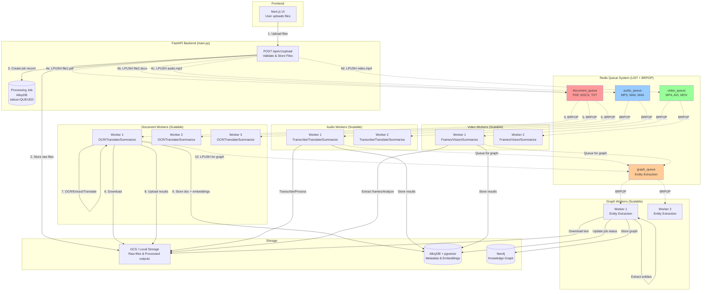

# Redis Queue System in Sentinel AI

## Overview

Sentinel AI uses **Redis Queues** (LIST data structure with BRPOP) for distributed work processing, not traditional Pub/Sub. This ensures:
- ✅ Each message consumed by ONE worker (true parallelism)
- ✅ Built-in load balancing across multiple workers
- ✅ Message persistence (not lost if worker offline)
- ✅ Scalable worker pools

## Architecture Diagram



## Queue vs Pub/Sub Comparison

| Feature | Redis Pub/Sub | Redis Queues (Our Choice) |
|---------|---------------|---------------------------|
| **Distribution** | Broadcast to ALL subscribers | ONE worker per message |
| **Load Balancing** | Manual implementation needed | Automatic |
| **Message Persistence** | Lost if no active subscribers | Persisted until consumed |
| **Scaling Workers** | No benefit (all get same message) | Linear scaling |
| **Use Case** | Real-time notifications | Work distribution |

## Detailed Flow

### 1. File Upload & Queue Dispatch

```python
# In main.py - POST /api/v1/upload
for filename, file_type in zip(filenames, file_types):
    gcs_path = f"{gcs_prefix}{filename}"
    
    if file_type == 'document':
        # Push to document queue
        redis_pubsub.push_file_to_queue(
            job_id, gcs_path, filename, 
            settings.REDIS_QUEUE_DOCUMENT
        )
    elif file_type == 'audio':
        # Push to audio queue
        redis_pubsub.push_file_to_queue(
            job_id, gcs_path, filename,
            settings.REDIS_QUEUE_AUDIO
        )
    elif file_type == 'video':
        # Push to video queue
        redis_pubsub.push_file_to_queue(
            job_id, gcs_path, filename,
            settings.REDIS_QUEUE_VIDEO
        )
```

**Message Format**:
```json
{
  "job_id": "manager1/analyst1/uuid-123",
  "gcs_path": "uploads/manager1/analyst1/uuid-123/report.pdf",
  "filename": "report.pdf",
  "action": "process_file"
}
```

### 2. Worker Consumption

```python
# In document_processor_service.py
redis_pubsub.listen_queue(
    queue_name=settings.REDIS_QUEUE_DOCUMENT,
    callback=service.process_job
)
```

**listen_queue Implementation**:
```python
def listen_queue(self, queue_name: str, callback):
    while True:
        # Block until message available, pop from right
        result = self.redis_client.brpop(queue_name, timeout=1)
        
        if result:
            queue, message_data = result
            data = json.loads(message_data)
            callback(data)  # Process ONE message
```

### 3. Distributed Locking

To prevent duplicate processing when multiple workers exist:

```python
# In worker's process_job method
existing_doc = db.query(Document).filter(
    Document.job_id == job.id,
    Document.original_filename == filename
).first()

if existing_doc and existing_doc.summary_path:
    # Another worker already processed this file
    print(f"File {filename} already processed, skipping")
    return  # Exit without processing
```

### 4. Cascading Queue Pattern

```
document_queue → Document Worker → Process → graph_queue
audio_queue    → Audio Worker    → Process → graph_queue
video_queue    → Video Worker    → Process → graph_queue

graph_queue    → Graph Worker    → Extract entities → Neo4j
```

## Queue Configuration

In `config.py`:

```python
# Redis Queues (for parallel processing with work distribution)
REDIS_QUEUE_DOCUMENT: str = "document_queue"
REDIS_QUEUE_AUDIO: str = "audio_queue"
REDIS_QUEUE_VIDEO: str = "video_queue"
REDIS_QUEUE_GRAPH: str = "graph_queue"
```

## Scaling Workers

### Docker Compose Scaling

```bash
# Scale document workers to 3 instances
docker-compose up -d --scale document-processor=3

# Scale all workers
docker-compose up -d \
  --scale document-processor=3 \
  --scale audio-processor=2 \
  --scale video-processor=2 \
  --scale graph-processor=2
```

### Worker Distribution Example

```
document_queue: [file1.pdf, file2.docx, file3.txt, file4.pdf]
                      ↓           ↓           ↓           ↓
Worker 1: ←───────── file1.pdf
Worker 2: ←───────────────────── file2.docx
Worker 3: ←───────────────────────────────── file3.txt
Worker 1: ←───────────────────────────────────────────── file4.pdf
```

Each file processed by exactly ONE worker. Automatic load balancing.

## Queue Monitoring

### Check Queue Length

```bash
redis-cli LLEN document_queue
redis-cli LLEN audio_queue
redis-cli LLEN video_queue
redis-cli LLEN graph_queue
```

### Inspect Queue Contents (without removing)

```bash
# View first 10 messages
redis-cli LRANGE document_queue 0 9
```

### Clear Queue (if needed)

```bash
redis-cli DEL document_queue
```

## Why This Architecture?

1. **True Parallelism**: Multiple workers process different files simultaneously
2. **Fault Tolerance**: If worker dies, message stays in queue for another worker
3. **Scalability**: Add more workers → automatic increased throughput
4. **Simplicity**: No complex coordination logic needed
5. **Visibility**: Queue lengths show processing backlog
6. **Reliability**: Messages persist in Redis until successfully processed

## Migration from Pub/Sub

**Old Code** (Pub/Sub, now deprecated):
```python
# Publisher
redis_pubsub.publish_job(job_id, gcs_prefix, channel)

# Consumer
redis_pubsub.listen(channel, callback)
```

**New Code** (Queues, current):
```python
# Publisher
redis_pubsub.push_file_to_queue(job_id, gcs_path, filename, queue_name)

# Consumer
redis_pubsub.listen_queue(queue_name, callback)
```

## Summary Flow

1. **Upload** → Files stored in GCS/Local
2. **Dispatch** → Per-file messages pushed to Redis queues (LPUSH)
3. **Consume** → Workers pull messages (BRPOP) - ONE worker per message
4. **Lock** → Database check prevents duplicate processing
5. **Process** → Extract/Translate/Summarize/Analyze
6. **Store** → Results saved to GCS/AlloyDB
7. **Cascade** → Push to graph_queue for entity extraction
8. **Complete** → Job marked COMPLETED when all files done

This architecture ensures efficient, parallel, and reliable document processing at scale.
